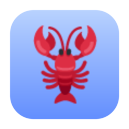
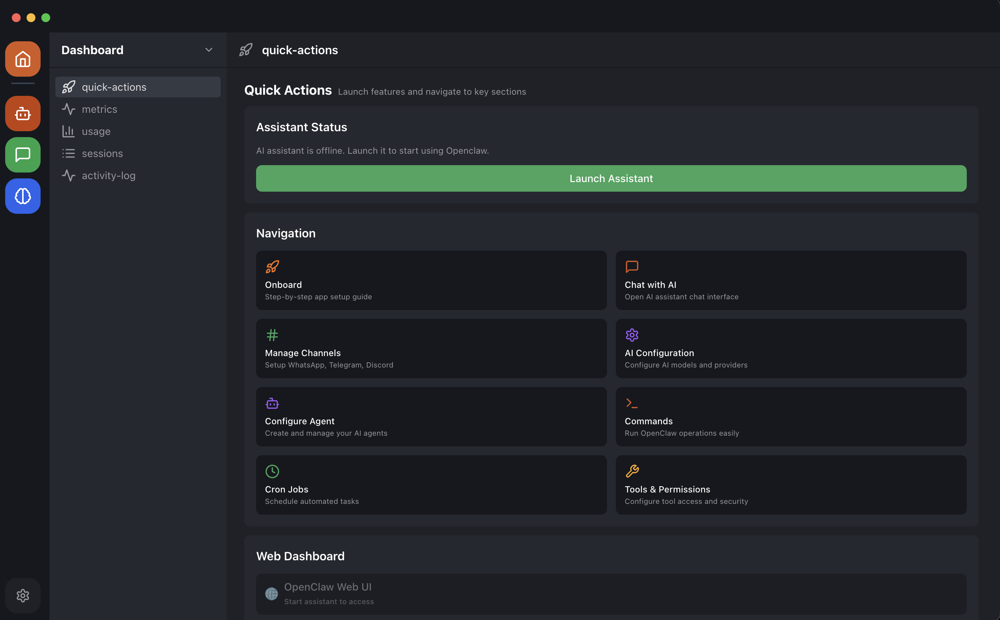

<p align="center">
  
</p>

<h1 align="center">OpenClaw Easy</h1>

<p align="center">
  <strong>AI on your messaging apps in minutes. No terminal. No config files. Just download and go.</strong>
</p>

<p align="center">
  <a href="https://github.com/openclaw-easy/openclaw-easy-desktop/stargazers"></a>
  <a href="https://github.com/openclaw-easy/openclaw-easy-desktop/blob/main/LICENSE"></a>
  <a href="https://openclaw-easy.com"></a>
  
  
  
  
</p>

<p align="center">
  <a href="https://openclaw-easy.com"></a>
  &nbsp;&nbsp;
  <a href="https://openclaw-easy.com"></a>
</p>

<p align="center">
  <a href="https://openclaw-easy.com">Download</a> &bull;
  <a href="https://docs.openclaw.ai">Docs</a> &bull;
  <a href="https://github.com/openclaw-easy/openclaw-easy-desktop/issues">Issues</a> &bull;
  <a href="https://github.com/openclaw/openclaw">OpenClaw Core</a>
</p>

---

<p align="center">
  
</p>

---

## What is OpenClaw Easy?

[OpenClaw](https://github.com/openclaw/openclaw) is a powerful open-source AI agent platform that connects to WhatsApp, Telegram, Discord, Slack, and many more. But setting it up requires command-line skills and technical configuration.

**OpenClaw Easy** wraps it all into a beautiful desktop app. Just launch, connect your AI provider, scan a QR code, and your messaging apps are powered by AI.

## Why OpenClaw Easy?

| | Feature | Details |
|---|---|---|
| :zap: | **Zero Setup** | No terminal, no config files, no dependencies. Download, install, done. |
| :package: | **One-Click Install** | macOS DMG or Windows EXE. Drag-and-drop or double-click. |
| :iphone: | **WhatsApp in 60 Seconds** | Just scan a QR code. No bot tokens, no webhooks, no server. |
| :brain: | **All Major AI Models** | Claude, ChatGPT, Gemini, DeepSeek, Llama, and more. |
| :house: | **Local AI with Ollama** | Run models 100% offline on your machine. No API keys needed. |
| :lock: | **100% Local & Private** | Your data stays on your machine. Nothing uploaded to any cloud. |
| :sparkles: | **Managed AI Option** | Don't want to deal with API keys? Just sign in and go. |
| :gift: | **Free to Use** | Download and use with your own API keys at no cost. |
| :arrows_counterclockwise: | **Auto-Updates** | The app updates itself. No manual work. |

## Supported Channels

<p>
  
  
  
  
  
  
</p>

## Supported AI Providers

<p>
  
  
  
  
  
  
  
</p>

## Features

- :rocket: **One-click gateway** -- Start/stop the OpenClaw gateway from the dashboard
- :key: **Bring Your Own Key** -- Use API keys from OpenAI, Anthropic, Google, Venice, OpenRouter, or DeepSeek
- :robot: **Agent management** -- Create, configure, and route multiple AI agents
- :jigsaw: **Skills & plugins** -- Browse and install skills from ClawHub
- :alarm_clock: **Cron jobs** -- Schedule recurring AI tasks
- :shield: **Tools & permissions** -- Fine-grained control over what your AI can do
- :speech_balloon: **Built-in chat** -- Chat with your AI directly in the app
- :desktop_computer: **Cross-platform** -- macOS (Apple Silicon + Intel) and Windows

## Quick Start

### Download the App

> :arrow_down: **Get started now at [openclaw-easy.com](https://openclaw-easy.com)** -- download the latest installer for macOS or Windows. Free!

### Build from Source

```bash
# Clone the repo
git clone https://github.com/openclaw-easy/openclaw-easy-desktop.git
cd openclaw-easy-desktop

# Install dependencies
pnpm install

# Start in development mode
pnpm --filter moltbot-easy-desktop dev
```

### Package for Distribution

```bash
# Build the OpenClaw core
cd openclaw && pnpm install && pnpm build && cd ..

# Prepare bundled resources
cd apps/desktop && ./scripts/prepare-bundle.sh && cd ../..

# Package the app
pnpm --filter moltbot-easy-desktop package
```

Built installers will be in `apps/desktop/dist-installers/`.

## Architecture

```
openclaw-easy-desktop/
├── apps/
│   └── desktop/              # Electron desktop app
│       ├── src/
│       │   ├── main/         # Electron main process
│       │   ├── preload/      # Preload bridge (IPC)
│       │   └── renderer/     # React UI
│       └── scripts/          # Build & bundle scripts
├── openclaw/                 # Core OpenClaw engine (MIT/Apache)
│   ├── src/                  # CLI & gateway source
│   └── extensions/           # Channel plugins
├── packages/
│   └── shared/               # Shared TypeScript types
└── docs/                     # Documentation & images
```

**How it works:**
1. **Main process** spawns the embedded OpenClaw gateway
2. **Gateway** handles AI conversations, channel connections, and agent routing
3. **Renderer** (React) communicates via IPC and WebSocket
4. **Config** stored locally at `~/.openclaw/` and `~/.openclaw-easy/`

## Tech Stack

<p>
  
  
  
  
  
  
  
</p>

## Contributing

We welcome contributions! Please see [CONTRIBUTING.md](docs/CONTRIBUTING.md) for guidelines.

1. Fork the repository
2. Create a feature branch (`git checkout -b feature/my-feature`)
3. Make your changes
4. Submit a pull request

## Links

- :globe_with_meridians: **Website**: [openclaw-easy.com](https://openclaw-easy.com)
- :book: **Docs**: [docs.openclaw.ai](https://docs.openclaw.ai)
- :lobster: **OpenClaw Core**: [github.com/openclaw/openclaw](https://github.com/openclaw/openclaw)
- :bug: **Issues**: [GitHub Issues](https://github.com/openclaw-easy/openclaw-easy-desktop/issues)

## License

This project is open source under the [Apache-2.0 License](LICENSE). The core OpenClaw engine included in `openclaw/` is licensed under [MIT/Apache-2.0](openclaw/LICENSE).

---

<p align="center">
  Built with :heart: by the <a href="https://github.com/openclaw-easy">OpenClaw Easy</a> team
</p>
