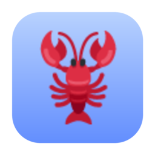
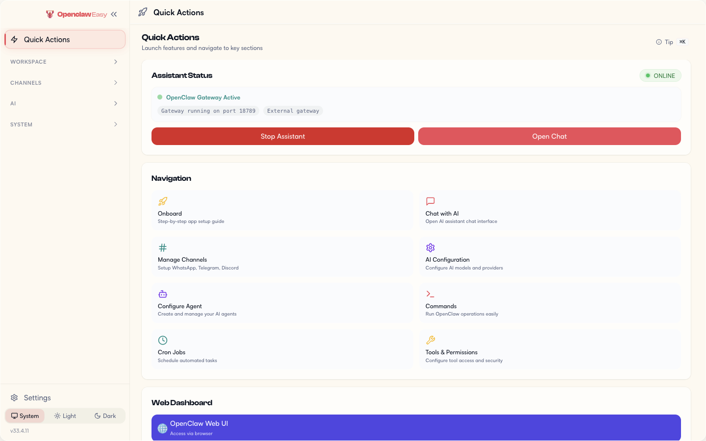
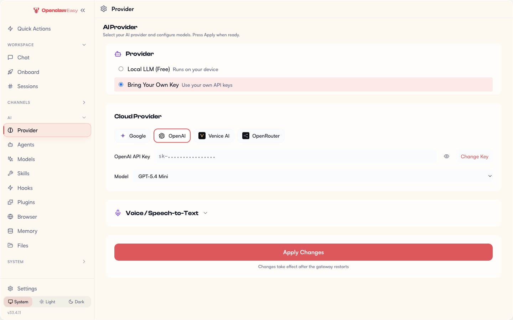

<p align="center">
  
</p>

<h1 align="center">OpenClaw Easy</h1>

<p align="center">
  <strong>Run an AI assistant on your messaging apps. No terminal, no config files, no server.</strong>
</p>

<p align="center">
  <a href="https://github.com/openclaw-easy/openclaw-easy-desktop/stargazers"></a>
  
  <a href="https://github.com/openclaw-easy/openclaw-easy-desktop/releases"></a>
  
  
  
  
</p>

<p align="center">
  <a href="https://github.com/openclaw-easy/openclaw-easy-desktop/releases">Releases</a> &bull;
  <a href="#quick-start">Quick Start</a> &bull;
  <a href="#build-from-source">Build from Source</a> &bull;
  <a href="https://docs.openclaw.ai">OpenClaw Docs</a> &bull;
  <a href="https://github.com/openclaw/openclaw">OpenClaw Core</a>
</p>

---

<p align="center">
  
</p>

---

## What is this?

[OpenClaw](https://github.com/openclaw/openclaw) is an open-source AI agent platform that connects to WhatsApp, Telegram, Discord, Slack and more. Running it normally means a terminal, a config file and a process to babysit.

**OpenClaw Easy** is a desktop app that wraps the whole thing. It bundles the OpenClaw gateway, starts and stops it for you, and puts the configuration behind a UI. You bring an API key from a provider you already use — or run a model locally and use no key at all.

> **Bring your own key.** There is no account, no sign-up and no hosted service in this build. Your keys and conversations stay on your machine, and the app talks directly to whichever provider you configure.

## Why use it

| | | |
|---|---|---|
| ⚡ | **No setup** | No terminal, no YAML, no dependencies to install first. |
| 📦 | **One installer** | macOS `.dmg` or Windows `.exe`. |
| 📱 | **WhatsApp by QR code** | Scan and you're connected — no bot token, no webhook, no public URL. |
| 🏠 | **Local models** | Run Ollama models fully offline. No key, no network. |
| 🔒 | **Local and private** | Config and history live on your machine. |
| 🔑 | **Your own key** | Use a provider account you control. |
| 🔄 | **Self-updating** | Checks this repository's releases and tells you when a build is out. |

## Configure a provider once

<p align="center">
  
</p>

Pick **Local LLM** to run offline through Ollama, or **Bring Your Own Key** and paste a key for the provider you want. Apply, and the gateway restarts with the new configuration.

## Channels

<p>
  
  
  
  
  
  
</p>

## AI providers

<p>
  
  
  
  
  
</p>

Claude and DeepSeek are reachable through OpenRouter. Direct Anthropic API keys are not supported.

## Features

- **Gateway control** — start, stop and watch the bundled OpenClaw gateway from the dashboard
- **Agents** — create and configure multiple agents, route channels to them, set fallback models
- **Built-in chat** — talk to your assistant in the app, with voice input
- **Skills and plugins** — browse and install skills from ClawHub
- **Cron** — schedule recurring tasks
- **Tools and permissions** — control what the assistant is allowed to do
- **Memory, files and browser** — persistent memory, file access and a browsing tool
- **Sessions and activity** — see past conversations and what ran when
- **Doctor** — diagnose and repair a broken configuration
- **Command palette** — `⌘K` / `Ctrl+K` to jump anywhere
- **Light and dark themes**, six UI languages

## Quick Start

Download the installer for your platform from the [**Releases**](https://github.com/openclaw-easy/openclaw-easy-desktop/releases) page, open it, and launch the app. The first-run wizard walks you through picking a provider and connecting a channel.

> **macOS:** builds published from this repository are **not code-signed**, so Gatekeeper will warn you on first launch. Right-click the app and choose *Open* to run it anyway, or build from source yourself.

## Build from Source

**Requirements**

| | |
|---|---|
| Node.js | `22.22.3+`, `24.15+` or `25.9+` — **24 recommended** |
| pnpm | `11.15.1` (via `corepack enable`) |
| Platform | macOS or Windows for packaging; Linux works for development |

```bash
git clone https://github.com/openclaw-easy/openclaw-easy-desktop.git
cd openclaw-easy-desktop

corepack enable
pnpm install

# Build the bundled OpenClaw core once — the app needs its dist/ to run a gateway
pnpm core:build

# Start the app in development
pnpm dev
```

`pnpm dev` opens the app with hot reload for the renderer.

**Other commands**

```bash
pnpm build        # build the desktop app
pnpm test         # unit tests (vitest)
pnpm test:e2e     # Electron end-to-end tests (Playwright)
pnpm lint         # lint
pnpm format       # format
```

### Package installers

```bash
pnpm core:build                                   # build the core
cd apps/desktop && ./scripts/prepare-bundle.sh    # stage Node + Bun + core into the bundle
cd ../.. && pnpm package                          # produce installers
```

Output lands in `apps/desktop/dist-installers/`.

`prepare-bundle.sh` downloads the Node and Bun runtimes that ship inside the app. Node runs the gateway — it needs `node:sqlite`, which Bun does not provide — and Bun is used to install dependencies.

## Architecture

```
openclaw-easy-desktop/
├── apps/
│   └── desktop/            # Electron app
│       ├── src/main/       # main process: gateway lifecycle, config, IPC
│       ├── src/preload/    # context-isolated IPC bridge
│       ├── src/renderer/   # React UI
│       ├── e2e/            # Playwright tests
│       └── scripts/        # bundle + packaging scripts
├── openclaw/               # vendored OpenClaw core (gateway, CLI, channel plugins)
├── packages/shared/        # shared types
└── docs/images/            # README assets
```

**How it fits together**

1. The main process spawns the bundled OpenClaw gateway as a child process.
2. The gateway owns AI conversations, channel connections and agent routing.
3. The renderer talks to the main process over IPC, and to the gateway over WebSocket.
4. Configuration lives in `~/.openclaw/`; app preferences in `~/.config/openclaw-desktop/`.

The `openclaw/` directory is a vendored copy of the upstream core, pinned to a known-good commit and built as part of this workspace. It is not a submodule — clone and go.

## Tech Stack

<p>
  
  
  
  
  
  
  
  
  
</p>

## Contributing

Contributions are welcome — see [CONTRIBUTING.md](CONTRIBUTING.md).

1. Fork and branch (`git checkout -b feature/my-feature`)
2. Make your change, and run `pnpm test` before opening a PR
3. Open a pull request describing what changed and why

Bug reports and feature requests belong in [Issues](https://github.com/openclaw-easy/openclaw-easy-desktop/issues). For bugs in the underlying agent platform rather than this app, use the [OpenClaw core repository](https://github.com/openclaw/openclaw).

## License

This project is declared MIT in `package.json`. A top-level `LICENSE` file has
not been added to the repository yet.

The vendored core in `openclaw/` is MIT and carries its own upstream notice; see
[openclaw/LICENSE](openclaw/LICENSE).

---

<p align="center">
  <a href="https://star-history.com/#openclaw-easy/openclaw-easy-desktop&Date"></a>
</p>

<p align="center">
  Built on <a href="https://github.com/openclaw/openclaw">OpenClaw</a>.
</p>
